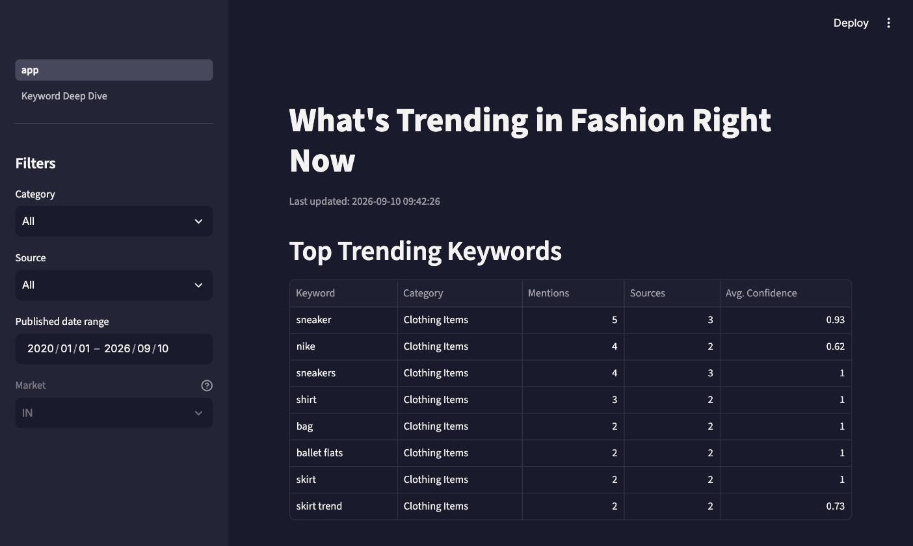
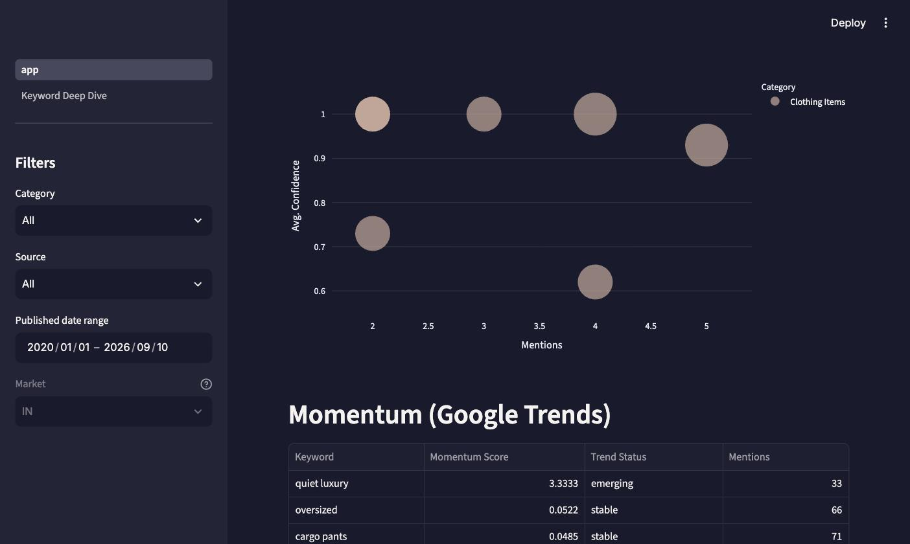
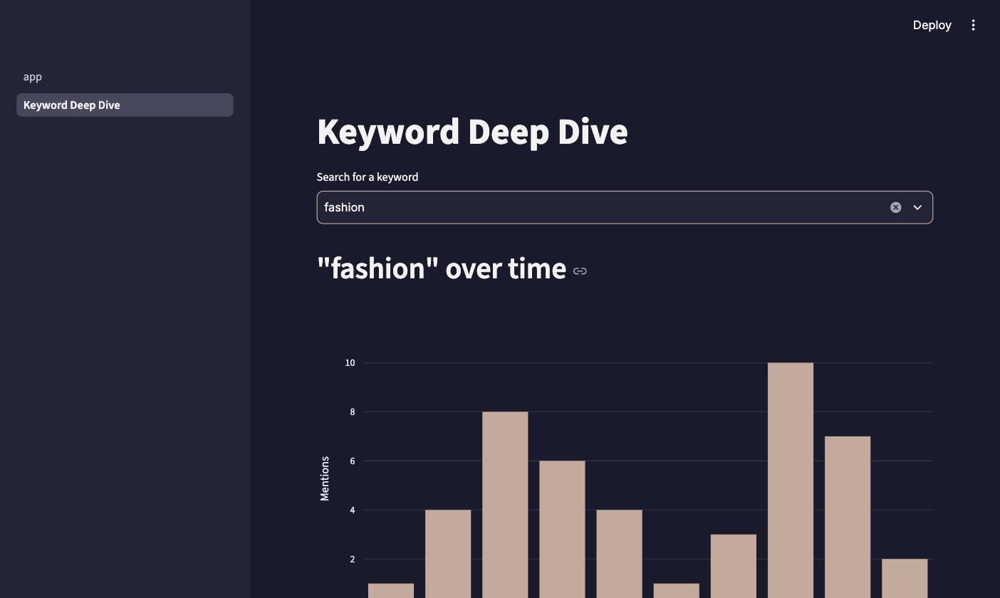

# Fashion Trend Intelligence Dashboard

A data pipeline that tracks emerging fashion trends from public sources — Google Trends, NewsAPI, and fashion-press web scraping — in near-real-time. It surfaces what's gaining momentum right now, structured and searchable, rather than requiring someone to manually browse Vogue or Reddit. It does **not** predict future trends; it tracks present momentum.

Built as a portfolio project demonstrating end-to-end pipeline ownership: ingestion → cleaning → NLP → scoring → (dashboard, in progress). See [`CLAUDE.md`](./CLAUDE.md) for the full original spec this project follows.

## Status

Phases 1–3 of the build (foundation, NLP processing, ingestion sources) are complete. Phase 4 (Streamlit dashboard) is in progress — Page 1 (Trend Radar) and Page 2 (Keyword Deep Dive) are built and working against real data; Pages 3–6 (Category Analysis, Colour Trends, Brand Monitor, Raw Data Explorer) are not yet built.

## Dashboard Preview

**Page 1 — Trend Radar:** top trending keywords ranked by real mention count and source diversity, with filters for category, source, and date range.



Trend Map bubble chart (mention volume × match confidence × source diversity × category) and the Momentum section, sourced separately from real Google Trends data:



**Page 2 — Keyword Deep Dive:** searchable across all ingested keywords, with a mention-volume time series, source breakdown, and linked recent mentions.



More screenshots will be added here as Pages 3–6 are built — see [`screenshots/README.md`](screenshots/README.md) for how to add one.

## Tech stack

- **Language / runtime:** Python 3.13
- **Storage:** SQLite (via SQLAlchemy)
- **Ingestion:** `pytrends` (Google Trends), `praw` (Reddit API), `newsapi-python` (NewsAPI), `requests` + `beautifulsoup4` + `protego` (web scraping, robots.txt-compliant)
- **NLP:** `keybert` + `sentence-transformers` (keyword extraction, semantic taxonomy matching), `rapidfuzz` (fuzzy matching), `langdetect` (language filtering)
- **Dashboard:** `streamlit` + `plotly`
- **Testing:** `pytest`, test-driven throughout (87 tests)
- **Logging:** `loguru`
- **Notebooks:** Jupyter, via `ipykernel`/`nbconvert`

## Data sources

| Source | What it provides | Status |
|---|---|---|
| Google Trends | Search interest over time for tracked fashion keywords | Working — 372+ rows ingested |
| NewsAPI | Fashion news articles (keyword search, no fashion-specific source filter exists on NewsAPI's free tier) | Working |
| Who What Wear, Highsnobiety, Hypebeast | Article headlines, authors, tags, publish dates (scraped via each site's news sitemap + `<head>` metadata, robots.txt-checked) | Working |
| Reddit (r/femalefashionadvice, etc.) | Real user conversations about what people are wearing | Built, but currently blocked — the Reddit developer account used for this project is subject to new-account API restrictions |

## How to run locally

**1. Clone and set up a virtual environment**
```bash
git clone git@github.com:Shloak-13/fashion-trend-intel.git
cd fashion-trend-intel
python3 -m venv .venv
source .venv/bin/activate
pip install -r requirements.txt
```

**2. Configure API keys**
```bash
cp .env.example .env
```
Fill in `.env`:
- `NEWS_API_KEY` — free at [newsapi.org](https://newsapi.org)
- `REDDIT_CLIENT_ID` / `REDDIT_CLIENT_SECRET` — free at [reddit.com/prefs/apps](https://www.reddit.com/prefs/apps) (create a "script" app)
- `DATABASE_URL` — defaults to `sqlite:///data/fashion_trends.db`, no changes needed for local use

**3. Initialize the database**
```bash
python -c "from src.storage import db; db.init_db()"
```
This creates `data/fashion_trends.db` from `src/storage/schema.sql`.

**4. Run the ingesters**
```bash
python -m src.ingestion.google_trends    # no API key needed
python -m src.ingestion.news_scraper     # needs NEWS_API_KEY
python -m src.ingestion.web_scraper      # scrapes all three sites (Who What Wear, Highsnobiety, Hypebeast)
python -m src.ingestion.reddit_scraper   # needs REDDIT_CLIENT_ID/SECRET
```

**5. Run the processing pipeline**
```bash
python -m src.processing.nlp_pipeline    # keyword extraction + taxonomy categorisation
python -m src.processing.scorer          # momentum scoring on Google Trends data
```

**6. Run the dashboard**
```bash
streamlit run src/dashboard/app.py
```
Opens at `http://localhost:8501`. Page 2 (Keyword Deep Dive) is auto-discovered from `src/dashboard/pages/` and appears in the sidebar nav.

**7. Explore the results directly**
```bash
jupyter notebook notebooks/02_nlp_experiments.ipynb
```
Or query `data/fashion_trends.db` directly (e.g. `sqlite3 data/fashion_trends.db`).

**8. Run the tests**
```bash
pytest tests/ -v
```

## Known limitations

- **English-only.** No Hindi/regional-language support in v1.
- **No Instagram/TikTok.** The two most important fashion-hype signals are inaccessible via public APIs — not scraped, by design (against ToS / aggressively blocked).
- **Not real-time.** Ingesters run on demand / on a schedule, not continuously — not suited to fast-moving intra-day hype cycles.
- **Reddit currently blocked.** The developer account hit new-account API restrictions; the ingester is built and tested but not producing live data right now.
- **Taxonomy is clothing-only.** The fixed keyword taxonomy (items, silhouettes, colours, patterns, aesthetics, occasions) has no category for beauty/hair/skincare content or fashion-industry concepts like "capsule collection" — real content in those areas is correctly extracted but won't match any taxonomy category. Confirmed directly: only ~47% of NewsAPI articles and ~60% of Who What Wear articles (small sample) have any taxonomy-matched keyword, and manual review traces most of the gap to taxonomy scope rather than extraction quality.
- **No brand-name recognition yet.** Named-entity recognition for brands (Section 6.2, Step 4 of the original spec) is deferred — brand-heavy articles often produce zero taxonomy matches even when clearly fashion-relevant, since brand names aren't in the taxonomy.
- **Momentum scoring is tuned for document counts, not Google's 0–100 interest scale.** Trend classification bands (`rising`, `peak`, etc.) assume mention counts in the hundreds/thousands; single-source Google Trends signals mostly classify as `stable`/`emerging` until Reddit/News mention volume is flowing at comparable scale.
- **Small early dataset.** With ingestion only recently started, there isn't yet enough history for momentum scoring to be highly reliable — CLAUDE.md flagged this as an expected v1 limitation, and it still applies.
- **Dashboard is partial.** Only Pages 1–2 of the planned 6-page Streamlit dashboard are built; the rest of the results still live only in the SQLite database and the Jupyter notebook.

## Project structure

```
src/
├── ingestion/        # Google Trends, Reddit, NewsAPI, web scraper (3 sites)
├── processing/       # cleaning, NLP pipeline, taxonomy categoriser, momentum scorer
├── storage/          # SQLite schema + connection/query helpers
└── dashboard/        # Streamlit app (app.py = Page 1; pages/ = Pages 2+)
notebooks/            # results and findings, narrated
screenshots/          # dashboard screenshots used in this README
tests/                 # pytest suite (87 tests, TDD throughout)
```
